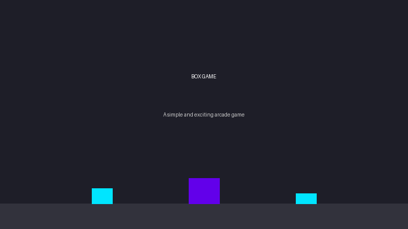

# Box Game Download Page

A professional, sleek, and modern web page for downloading the Box Game. This landing page is designed to look like it was developed by a large tech company, with modern UI elements, animations, and a user-friendly interface.



## Features

- **Modern Design**: Clean, professional UI with animations and transitions
- **Responsive Layout**: Works on all devices from mobile to desktop
- **Download Counter**: Shows how many people have downloaded the game
- **Interactive Elements**: Animated buttons, cards, and sections
- **Game Instructions**: Clear steps on how to download and play
- **Game Controls**: Visual representation of game controls
- **FAQ Section**: Common questions and answers
- **Social Media Integration**: Links to social platforms

## Game Controls

- **A Key**: Move left
- **D Key**: Move right
- **W Key**: Stop movement

## Technologies Used

- **HTML5**: Semantic markup for better accessibility and SEO
- **CSS3**: Modern features including CSS variables, flexbox, and animations
- **JavaScript**: ES6+ for interactive elements and animations
- **Font Awesome**: For icons and visual elements
- **Google Fonts**: For typography

## How to Deploy to Vercel

1. Install Vercel CLI:
   ```bash
   npm install -g vercel
   ```

2. Login to Vercel:
   ```bash
   vercel login
   ```

3. Deploy the project:
   ```bash
   vercel
   ```

4. For production deployment:
   ```bash
   vercel --prod
   ```

## Local Development

To run this website locally:

1. Clone the repository:
   ```bash
   git clone https://github.com/Rishirajbal/unity.git
   cd unity/game-download-page
   ```

2. Start a local server:
   ```bash
   # Using Python
   python -m http.server
   
   # Or using Node.js
   npx serve
   ```

3. Open your browser and navigate to `http://localhost:8000` (or the port shown in your terminal).

## Customization

- **Colors**: Edit the CSS variables in the `:root` selector in `styles.css`
- **Content**: Modify the text and images in `index.html`
- **Animations**: Adjust the animation parameters in `script.js`
- **Download File**: Replace `box game_full_zip.zip` with your game file

## Screenshots


## License

This project is licensed under the MIT License.
